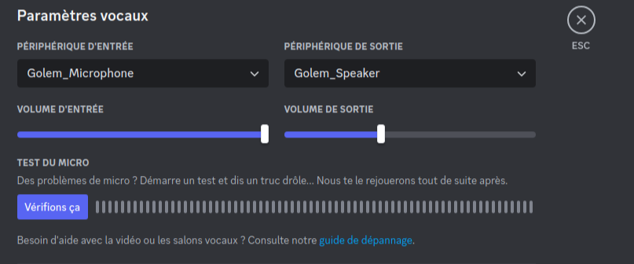
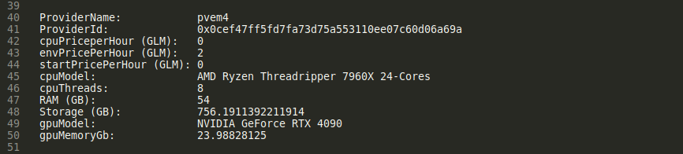
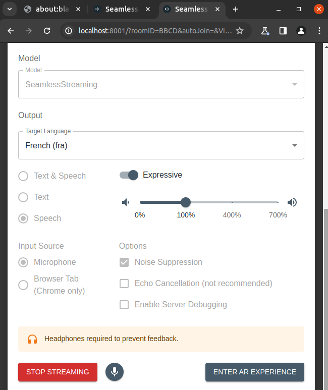

# Golem SST

This application allows you to converse in our native language with someone speaking another language.  
It runs on Golem Network with GPU providers and works with the usual chat tools (Dicord, Teams, Duo, etc.).  
To do this, it presents the Golem Microphone and Golem_Speaker audio inputs/outputs to configure in the chat application.  

<p>
  
&nbsp; 
  
</p>

This application is based on Meta's Seamless Communication AI model (https://huggingface.co/spaces/facebook/seamless-streaming).  
Meta's model aims to preserve the subtleties of discourse such as pauses and speaking rate in addition to vocal style and emotional tone.  

<p align="center">
 
</p>

This tool is only for LINUX requestor.  

**Requirements:**  
 - Yagna requestor with funds (GLM on Polygon network)  
 - nodejs  
 - nodejs packages @golem-sdk/golem-js, commander, puppeteer, crypto  
 - ssh, sshpass  
 - pulseaudio (pactl)  

**How to use:**  

``` 
node sst.mjs
``` 

Parameters:  

- --subnet <subnet>                          subnet (default: "public")  
- --paymentDriver <paymentDriver>            (choices: "erc20", "erc20next", default: "erc20")  
- --paymentNetwork <paymentNetwork>          (choices: "polygon", "mainnet", default: "polygon")  
- --budget <budget>                          budget (default: 2)  
- --maxStartPrice <maxStartPrice>            maxStartPrice (default: 0)  
- --maxCpuPricePerHour <maxCpuPricePerHour>  maxCpuPricePerHour (default: 0)  
- --maxEnvPricePerHour <maxEnvPricePerHour>  maxEnvPricePerHour (default: 2)  
- --inputLanguage <inputLanguage>            (choices: See below for supported languages)  
- --outputLanguage <outputLanguage>          (choices: See below for supported languages)  
- --providerId <providerid>                  providerid (default: "")  
- --useOnlyWhitelisted                       useOnlyWhitelisted (default: true)  
- --debug                                    debug (default: false)  

Supported languages:  

     English (eng), Arabic (arb), Bengali (ben), Catalan (cat), Czech (ces), Chinese (cmn), Welsh (cym), Danish (dan),  
     German (deu), Estonian (est), Finnish (fin), French (fra), Hindi (hin), Indonesian (ind), Italian (ita), Japanese (jpn),  
     Korean (kor), Maltese (mlt), Dutch (nld), Persian (pes), Polish (pol), Portuguese (por), Romanian (ron), Russian (rus),  
     Slovak (slk), Spanish (spa), Swedish (swe), Swahili (swh), Telugu (tel), Tagalog (tgl), Thai (tha), Turkish (tur),  
     Ukrainian (ukr), Urdu (urd), Uzbek (uzn), Vietnamese (vie)  

By default, the public subnet will be used with the erc20 network driver, the polygon payment driver and a GPU provider whitelist.  
The image has already been uploaded to these providers (whitelisted).  
Their prices are 1 GLM/h for the RTX3090 and 2 GLM/h for the RTX4060.  

This application requires a GPU with at least 12 GB of VRAM and 10 GB of RAM.  

Use the --inputLanguage <inputLanguage> and --outputLanguage <outputLanguage> options to configure the languages.  
inputLanguage correspond to what you hear in your headphones and outputLanguage to what your interlocutor will hear.  

If you want to use a specific (compatible) GPU provider, use the --providerId <providerid> option.  
If you want to use a GPU provider among all those available (the cheapest), use the '--useOnlyWhitelisted false' option.  

You can also set your prices and budget with the maxStartPrice, maxCpuPricePerHour, maxEnvPricePerHour and budget options.  

The list of compatible GPU providers is saved in the gpu_providers.txt file in order to guide your choices.  

<p align="center">
 
</p>

The application takes about a minute to launch.  

<p align="center">
 
</p>

You can run this application in debug mode, you will be able to access the provider in ssh and the configuration web pages.  
In debug mode, you can modify the translation parameters directly (language, sts/sts&t mode, etc.).  

<p align="center">
 
</p>

<p align="center">
 
</p>

